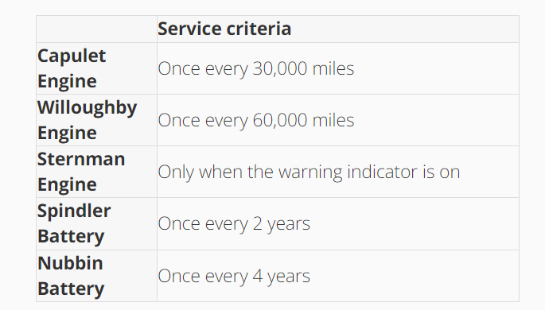
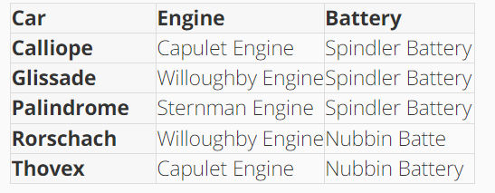

# Lyft Back-End Engineering Virtual Experience Program

## Table of Contents

- [Overview](#overview)
  - [Scenario](#scenario)
  - [Project at hand](#project-at-hand)
  - [My Tasks](#my-tasks)
  - [Skills](#skills)
  - [Tools](#tools)
  - [Acknowledgement](#acknowledgement)

## Overview

### Scenario

- I am working as a Back-End Engineer at Lyft.
- As a Back-End Engineer I need to collaborate within a larger team made up of software engineering, product, data science, analytics and operations.
- My team is responsible for Lyft Rentals. **Lyft Rentals provides vehicles for riders who are looking to rent a vehicle for personal use such as a weekend vacation**.
- Throughout the program your team will takeover an unfinished project to:
  - Come up with a clean design for an existing, unfinished component
  - Refactor a messy codebase
  - Write unit tests for your newly refactored system
  - Add new functionality to your system using Test-Driven Development

### Project At Hand

Lyft is in the process of rolling out a new rental fleet in the hopes of encouraging more connected, sustainable cities across the US.

My team has inherited an urgent project from a fellow colleague here at Lyft who had to make a pivot to a different project. The colleague was in the process of developing a component that is used by the rental fleet’s new logistics system. Unfortunately that component was only partially completed and my team’s responsibility is to now finalize that component and make it functional.

The component itself is responsible for determining whether cars in Lyft’s new rental fleet should be serviced when they are returned. The work I will do on this component will be carried through the each of the tasks within this program.

### Criteria for car servicing

Whether or not a Lyft rental car should be serviced depends on two factors at the moment:

- The engine; and
- The battery

Each of the three types of engines has its own criteria for determining when it should be serviced. The same applies to each type of battery.

There are five car models in Lyft’s fleet, each with a different engine-battery combination. These are outlined below:

These service criteria will change somewhat frequently in the future, and new car models are bound to be added to the fleet. This is an important consideration throughout the program.

With this in mind, it’s very important that the component is extensible and easy to modify, so new service criteria can be added quickly and efficiently. Just today, you learned that the system must also take tires into account when determining if a car should be serviced in the future.

Tacking this functionality onto the current system would be difficult and messy - instead, you have been instructed to take the time to refactor the codebase prior to making the change. The first step of this process is to draft up a new (clean) system architecture that will allow for the seamless inclusion of the new functionality. My task is to draft and submit a class diagram that maps out how the system will be reorganized.

### My Tasks

**Task 1 (Come up with a clean design for a messy component) :**

- Familiarize with the incomplete codebase
- draft a UML class diagram that represents a new reorganized architecture.

**Task 2 (Refactor a messy system) :**

- Refactoring is the art of reorganizing a codebase without modifying its behavior.

**Task 3 (Write unit tests for a newly refactored system) :**

- Write unit tests for each of the battery and engine classes in the codebase.

**Task 4 (Add new functionality using TDD) :**

- using a test-driven development workflow - often abbreviated TDD - to make the changes.

- Adding following two new functionality

  - Upgrade Spindler batteries
    - First, modify the Spindler battery so it requires service after three years instead of two.
  - Add tire servicing criteria

- Add tire servicing criteria
  - There are two types of tires currently in use by the Lyft fleet - Carrigan tires and Octoprime tires.
  - The new tire wear sensors produce an array of four numbers between 0 and 1 inclusive, representing how worn each of the tires are.
  - This array will be passed to each function in the car factory class, to be used by your tire implementation.
  - Carrigan tires should be serviced only when one or more of the values in the tire wear array is greater than or equal to 0.9.
  - Octoprime tires should be serviced only when the sum of all values in the tire wear array is greater than or equal to 3.
     

### Skills

- **UML - Class Diagram**
- **Unit Testing**
- **TDD (Test-Driven Development)**

### Tools

### Acknowledgement

- Lyft
- Forage
